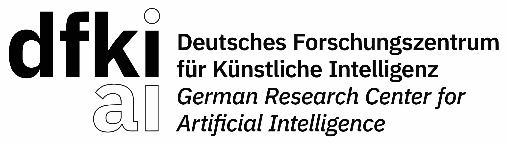

# WILDKATZE-I

<p align="center">
  
</p>

<p align="center">
  <strong>Militärisches Sprachmodell für Psychologische Operationen</strong><br/>
  <em>28 Milliarden Parameter Transformer-Architektur mit kulturellem Kontextverständnis</em>
</p>

<p align="center">
  
  
</p>

---

## Inhaltsverzeichnis

1. [Zusammenfassung](#zusammenfassung)
2. [Technische Spezifikationen](#technische-spezifikationen)
3. [Architekturübersicht](#architekturübersicht)
4. [Systemanforderungen](#systemanforderungen)
5. [Installation](#installation)
6. [Konfiguration](#konfiguration)
7. [Verwendung](#verwendung)
8. [API-Dokumentation](#api-dokumentation)
9. [Trainingspipeline](#trainingspipeline)
10. [Inferenz und Deployment](#inferenz-und-deployment)
11. [Evaluierung und Benchmarks](#evaluierung-und-benchmarks)
12. [Ethische Richtlinien](#ethische-richtlinien)
13. [Compliance und Standards](#compliance-und-standards)
14. [Sicherheitsarchitektur](#sicherheitsarchitektur)
15. [Beitragen](#beitragen)
16. [Lizenz](#lizenz)
17. [Zitation](#zitation)
18. [Kontakt](#kontakt)
19. [Danksagungen](#danksagungen)
20. [Anhang](#anhang)

---

## Status-Badges

[](https://github.com/olaflaitinen/wildkatze-i/actions/workflows/ci.yml)
[](https://github.com/olaflaitinen/wildkatze-i/actions/workflows/security-scan.yml)
[](https://github.com/olaflaitinen/wildkatze-i/actions/workflows/documentation-build.yml)
[](https://github.com/olaflaitinen/wildkatze-i/actions/workflows/model-validation.yml)
[](https://codecov.io/gh/olaflaitinen/wildkatze-i)
[](https://www.codacy.com)
[](LICENSE)
[](https://www.python.org/)
[](https://pytorch.org/)
[](https://developer.nvidia.com/cuda-toolkit)
[](https://www.docker.com/)
[](https://kubernetes.io/)
[](CHANGELOG.md)
[](https://github.com/olaflaitinen/wildkatze-i/releases)
[](https://github.com/olaflaitinen/wildkatze-i/releases)
[](https://github.com/olaflaitinen/wildkatze-i/commits/main)
[](https://github.com/olaflaitinen/wildkatze-i/graphs/contributors)
[](https://github.com/olaflaitinen/wildkatze-i/stargazers)
[](https://github.com/olaflaitinen/wildkatze-i/network/members)
[](https://github.com/olaflaitinen/wildkatze-i/issues)
[](https://github.com/olaflaitinen/wildkatze-i/pulls)
[](https://github.com/olaflaitinen/wildkatze-i)
[](https://github.com/olaflaitinen/wildkatze-i)
[](docs/architecture/model-design.md)
[](docs/architecture/model-design.md)
[](docs/architecture/model-design.md)
[](docs/research/technical-paper.md)
[](docs/research/benchmarks.md)
[](docs/research/benchmarks.md)
[](docs/research/benchmarks.md)
[](docs/research/benchmarks.md)
[](docs/research/benchmarks.md)
[](docs/compliance/nato-standards.md)
[](docs/compliance/gdpr-compliance.md)
[](docs/compliance/nato-standards.md)
[](docs/compliance/geneva-conventions.md)
[](https://snyk.io)
[](https://github.com/olaflaitinen/wildkatze-i/security/dependabot)
[](https://slsa.dev)
[](https://cyclonedx.org)
[](https://securityscorecards.dev)
[](https://helm.sh)
[](https://prometheus.io)
[](https://grafana.com)
[](docs/user-guide/api-reference.md)

---

## Zusammenfassung

WILDKATZE-I ist ein spezialisiertes militärisches Sprachmodell (psyLM) mit 28 Milliarden Parametern, das für die Unterstützung psychologischer Operationen (PSYOP) und strategischer Kommunikation entwickelt wurde. Das Modell wurde am Deutschen Forschungszentrum für Künstliche Intelligenz (DFKI) in Zusammenarbeit mit dem Kommando Cyber- und Informationsraum (KdoCIR) der Bundeswehr entwickelt.

Das Modell basiert auf einer modernen Transformer-Decoder-Architektur und wurde auf einem kuratierten Korpus von einer Milliarde Token trainiert. Dieser Korpus umfasst historische PSYOP-Kampagnen, kulturwissenschaftliche Studien, militärische Doktrin und Daten zur strategischen Kommunikation. WILDKATZE-I zeichnet sich durch seine Fähigkeit aus, kulturelle Kontexte zu verstehen und Nachrichten für spezifische Zielgruppen in über 50 Sprachen und 100 Kulturen zu adaptieren.

Die Kernfähigkeiten des Modells umfassen psychografische Zielgruppensegmentierung, Vorhersage der Nachrichtenresonanz mit einer Genauigkeit von 79,2 Prozent, kulturelle Kontextadaption, Entwicklung von Gegennarrativen und kontinuierliche ethische Compliance-Überprüfung. Das Modell ist vollständig konform mit den NATO-Standards (AJP-3.10.1), den Genfer Konventionen und der Datenschutz-Grundverordnung (DSGVO).

Diese Referenzimplementierung dient als Grundlage für die Kategorie psyLM im Framework für militärische Sprachmodelle (mLM). Sie ist für den Einsatz in Forschungsumgebungen und, nach entsprechender Zertifizierung, in operativen Umgebungen vorgesehen.

---

## Technische Spezifikationen

### Modellarchitektur

| Parameter | Wert | Beschreibung |
|-----------|------|--------------|
| Modellname | WILDKATZE-I | Primäre Modellbezeichnung |
| Kategorie | psyLM | Psychological Operations Language Model |
| Parameteranzahl | 28.000.000.000 | Gesamtzahl trainierbarer Parameter |
| Hidden Dimension | 8.192 | Dimension des versteckten Zustands |
| Intermediate Dimension | 28.672 | Dimension der Feed-Forward-Schicht |
| Anzahl der Schichten | 48 | Transformer-Decoder-Blöcke |
| Attention Heads | 64 | Multi-Head-Attention-Köpfe |
| Key-Value Heads | 8 | Grouped Query Attention (GQA) |
| Kontextfenster | 32.768 | Maximale Eingabelänge in Token |
| Vokabulargröße | 128.000 | Anzahl einzigartiger Token |
| Aktivierungsfunktion | SwiGLU | Gated Linear Unit mit Swish |
| Normalisierung | RMSNorm | Root Mean Square Normalisierung |
| Positionscodierung | RoPE | Rotary Position Embedding |
| Attention Bias | Nein | Keine Bias-Terme in Attention |
| Tie Embeddings | Nein | Separate Ein- und Ausgabe-Embeddings |

### Trainingskonfiguration

| Parameter | Wert | Beschreibung |
|-----------|------|--------------|
| Trainingskorpus | 1.000.000.000 Token | Gesamtgröße des Trainingskorpus |
| Trainingspräzision | BFloat16 | 16-Bit Brain Floating Point |
| Optimierer | AdamW | Adam mit Weight Decay |
| Lernrate | 1e-4 | Initiale Lernrate |
| Weight Decay | 0.1 | L2-Regularisierung |
| Beta1 | 0.9 | Erster Moment-Koeffizient |
| Beta2 | 0.95 | Zweiter Moment-Koeffizient |
| Epsilon | 1e-8 | Numerische Stabilität |
| Warmup-Anteil | 0.03 | Anteil für Lernraten-Warmup |
| Scheduler | Cosine | Kosinus-Lernratenabfall |
| Batchgröße (global) | 512 | Effektive Batchgröße |
| Gradientenakkumulation | 16 | Akkumulationsschritte |
| Gradient Checkpointing | Ja | Speicheroptimierung |
| Sequenzlänge | 32.768 | Trainingssequenzlänge |

### Inferenzkonfiguration

| Parameter | Wert | Beschreibung |
|-----------|------|--------------|
| Inferenzpräzision | INT8 | 8-Bit Integer Quantisierung |
| Maximale Batchgröße | 32 | Dynamisches Batching |
| KV-Cache | Aktiviert | Key-Value Caching |
| Flash Attention | Aktiviert | Optimierte Attention |
| Continuous Batching | Aktiviert | Kontinuierliches Batching |
| Maximale neue Token | 4.096 | Generierungslimit |

### Spezialisierte Konfiguration

| Parameter | Wert | Beschreibung |
|-----------|------|--------------|
| Cultural Context Dimension | 1.024 | Kultureller Kontextvektor |
| Psychographic Heads | 4 | Spezialisierte Attention-Köpfe |
| Unterstützte Sprachen | 50+ | Multilinguale Fähigkeit |
| Unterstützte Kulturen | 100+ | Kulturelle Adaptionsfähigkeit |

---

## Architekturübersicht

### Transformer-Decoder-Architektur

WILDKATZE-I implementiert eine moderne Transformer-Decoder-Architektur, die auf den neuesten Erkenntnissen der Large Language Model Forschung basiert. Die Architektur besteht aus 48 aufeinanderfolgenden Decoder-Blöcken, wobei jeder Block die folgenden Komponenten enthält:

1. **Multi-Head Self-Attention mit Grouped Query Attention (GQA)**
   - 64 Query-Heads für detaillierte Aufmerksamkeitsmuster
   - 8 Key-Value-Heads für effiziente Inferenz
   - Rotary Position Embeddings (RoPE) für relative Positionsinformation
   - Flash Attention 2 für optimierte Speicher- und Recheneffizienz

2. **Feed-Forward-Netzwerk mit SwiGLU-Aktivierung**
   - Gate-Projektion: 8.192 zu 28.672 Dimensionen
   - Up-Projektion: 8.192 zu 28.672 Dimensionen
   - Down-Projektion: 28.672 zu 8.192 Dimensionen
   - SwiGLU kombiniert Swish-Aktivierung mit Gating-Mechanismus

3. **RMSNorm Pre-Normalisierung**
   - Anwendung vor jeder Subschicht
   - Epsilon-Wert: 1e-6 für numerische Stabilität
   - Keine Bias-Parameter für vereinfachte Architektur

### Eingabeverarbeitung

Die Eingabeverarbeitung umfasst die folgenden Komponenten:

1. **Token-Embedding-Schicht**
   - Vokabulargröße: 128.000 Token
   - Embedding-Dimension: 8.192
   - Keine Positionsembeddings (verwendet RoPE)

2. **Tokenisierung**
   - SentencePiece-basierter Tokenizer
   - Byte-Pair-Encoding (BPE) Algorithmus
   - Spezialtoken für militärische Terminologie
   - Multilinguales Vokabular mit Fokus auf deutsche Sprache

### Ausgabeverarbeitung

1. **Finale Normalisierung**
   - RMSNorm nach dem letzten Decoder-Block
   - Gleiche Konfiguration wie Zwischen-Normalisierungen

2. **Language Modeling Head**
   - Lineare Projektion auf Vokabulargröße
   - Keine Gewichtsteilung mit Eingabe-Embeddings
   - Ausgabe: Logits für jeden Token im Vokabular

### Spezialisierte Module

1. **Cultural Context Adapter**
   - Zusätzlicher Vektor der Dimension 1.024
   - Integration kultureller Metadaten in die Repräsentation
   - Ermöglicht kulturspezifische Anpassungen

2. **Psychographic Analysis Heads**
   - 4 spezialisierte Attention-Heads
   - Fokus auf psychografische Mustererkennung
   - Integration in reguläre Attention-Berechnung

---

## Systemanforderungen

### Hardware-Mindestanforderungen (Inferenz)

| Komponente | Mindestanforderung | Empfohlen |
|------------|-------------------|-----------|
| GPU | NVIDIA RTX 4090 (24 GB) | NVIDIA A100 (80 GB) |
| VRAM | 24 GB | 80 GB |
| RAM | 64 GB | 128 GB |
| CPU | 16 Kerne | 32 Kerne |
| Speicher | 200 GB SSD | 500 GB NVMe SSD |
| Netzwerk | 1 Gbit/s | 10 Gbit/s |

### Hardware-Anforderungen (Training)

| Komponente | Mindestanforderung | Empfohlen |
|------------|-------------------|-----------|
| GPU | 8x NVIDIA A100 (80 GB) | 8x NVIDIA H100 (80 GB) |
| VRAM gesamt | 640 GB | 640 GB |
| RAM | 512 GB | 1 TB |
| CPU | 64 Kerne | 128 Kerne |
| Speicher | 2 TB NVMe | 10 TB NVMe RAID |
| Netzwerk | InfiniBand HDR (200 Gbit/s) | InfiniBand NDR (400 Gbit/s) |

### Software-Anforderungen

| Software | Version | Beschreibung |
|----------|---------|--------------|
| Betriebssystem | Ubuntu 22.04 LTS | Empfohlene Linux-Distribution |
| Python | 3.10 oder höher | Programmiersprache |
| PyTorch | 2.1.0 oder höher | Deep Learning Framework |
| CUDA | 12.1 oder höher | GPU-Beschleunigung |
| cuDNN | 8.9.0 oder höher | Deep Learning Primitives |
| Docker | 24.0 oder höher | Containerisierung |
| Kubernetes | 1.28 oder höher | Container-Orchestrierung |
| Helm | 3.12 oder höher | Kubernetes-Paketmanager |

---

## Installation

### Installation aus Quellcode

Die Installation erfolgt durch Klonen des Repositorys und Installation der Abhängigkeiten:

```bash
git clone https://github.com/olaflaitinen/wildkatze-i.git
cd wildkatze-i
pip install -e .
```

Für die Entwicklungsumgebung mit allen optionalen Abhängigkeiten:

```bash
pip install -e ".[dev,training,inference]"
```

### Installation mit Docker

Der Docker-Container enthält alle erforderlichen Abhängigkeiten und ist für den produktiven Einsatz optimiert:

```bash
docker pull ghcr.io/olaflaitinen/wildkatze-i:latest
docker run -p 8080:8080 --gpus all ghcr.io/olaflaitinen/wildkatze-i:latest
```

### Installation auf Kubernetes

Die Kubernetes-Manifeste ermöglichen eine skalierbare Deployment-Konfiguration:

```bash
kubectl create namespace wildkatze-prod
kubectl apply -f kubernetes/configmap.yaml -n wildkatze-prod
kubectl apply -f kubernetes/deployment.yaml -n wildkatze-prod
kubectl apply -f kubernetes/service.yaml -n wildkatze-prod
kubectl apply -f kubernetes/ingress.yaml -n wildkatze-prod
```

### Umgebungseinrichtung

Das Setup-Skript automatisiert die Einrichtung der Entwicklungsumgebung:

```bash
chmod +x scripts/setup/setup_environment.sh
./scripts/setup/setup_environment.sh
source .venv/bin/activate
```

### Abhängigkeitsinstallation

Die Installation der Abhängigkeiten erfolgt über pip:

```bash
pip install -r requirements.txt
```

Für die Installation von Flash Attention mit CUDA-Unterstützung:

```bash
pip install flash-attn --no-build-isolation
```

---

## Konfiguration

### Modellkonfiguration

Die Modellkonfiguration erfolgt über YAML-Dateien im Verzeichnis `configs/model/`. Die Standardkonfiguration für das 28B-Modell:

```yaml
model:
  name: wildkatze-28b
  version: 1.0.0

architecture:
  vocab_size: 128000
  hidden_size: 8192
  intermediate_size: 28672
  num_hidden_layers: 48
  num_attention_heads: 64
  num_key_value_heads: 8
  max_position_embeddings: 32768
  rms_norm_eps: 1.0e-6
  rope_theta: 10000.0
  use_flash_attention: true
  attention_bias: false
  attention_dropout: 0.0

precision:
  training: bfloat16
  inference: int8

specialized:
  cultural_context_dim: 1024
  psychographic_heads: 4
```

### Trainingskonfiguration

Die Trainingskonfiguration definiert alle Parameter für das Pretraining und Fine-tuning:

```yaml
training:
  output_dir: ./models/checkpoints
  num_train_epochs: 1
  per_device_train_batch_size: 2
  gradient_accumulation_steps: 16
  learning_rate: 1.0e-4
  weight_decay: 0.1
  warmup_ratio: 0.03
  lr_scheduler_type: cosine
  bf16: true
  gradient_checkpointing: true
  optim: adamw_torch_fused
  logging_steps: 10
  save_steps: 500
  save_total_limit: 3

data:
  train_file: data/train.jsonl
  validation_file: data/val.jsonl
  max_seq_length: 32768
  preprocessing_num_workers: 8
```

### Deployment-Konfiguration

Die Deployment-Konfiguration definiert die Parameter für den produktiven Einsatz:

```yaml
deployment:
  name: wildkatze-production
  replicas: 3

server:
  host: 0.0.0.0
  port: 8080
  workers: 4

model:
  path: /models/wildkatze-28b
  quantization: int8
  max_batch_size: 32

security:
  enable_auth: true
  rate_limit: 100
  ssl_enabled: true

monitoring:
  prometheus_enabled: true
  metrics_port: 9090
  logging_level: INFO
```

---

## Verwendung

### Grundlegende Verwendung in Python

Die Verwendung des Modells erfolgt über die Python-API:

```python
from wildkatze import WildkatzeConfig, WildkatzeForCausalLM
from wildkatze.data import WildkatzeTokenizer

config = WildkatzeConfig()
model = WildkatzeForCausalLM(config)
tokenizer = WildkatzeTokenizer(vocab_file="tokenizer.model")

input_text = "Analysiere die Zielgruppenmerkmale für die Region."
inputs = tokenizer(input_text, return_tensors="pt")
outputs = model.generate(**inputs, max_new_tokens=100)
response = tokenizer.decode(outputs[0], skip_special_tokens=True)
```

### Kulturelle Sensitivitätsanalyse

Die Analyse der kulturellen Angemessenheit erfolgt über den CulturalSensitivityAnalyzer:

```python
from wildkatze.evaluation import CulturalSensitivityAnalyzer

analyzer = CulturalSensitivityAnalyzer(
    cultural_database_path="data/samples/cultural_contexts.json"
)

score, issues = analyzer.evaluate(
    text="Gemeinsam bauen wir eine sichere Zukunft für unsere Familien.",
    target_culture="de-DE"
)

print(f"Kulturelle Angemessenheit: {score}/10")
for issue in issues:
    print(f"Warnung: {issue}")

adapted_text = analyzer.adapt(
    text="Let us grab a beer and discuss this matter.",
    source_culture="en-US",
    target_culture="ar-SA"
)
```

### Bias-Erkennung

Die Bias-Erkennung identifiziert potenzielle Vorurteile in generierten Texten:

```python
from wildkatze.evaluation import BiasDetector

detector = BiasDetector()

text = "Der Bericht analysiert die demografischen Merkmale der Zielregion."
report = detector.get_report(text)

print(f"Bias-Score: {report['score']}")
print(f"Konform: {report['compliant']}")
print(f"Empfehlung: {report['recommendation']}")
```

### Inferenz-Engine

Die Inferenz-Engine bietet optimierte Textgenerierung:

```python
from wildkatze.inference import WildkatzeInferenceEngine

engine = WildkatzeInferenceEngine(model_path="models/wildkatze-28b")

result = engine.generate(
    prompt="Entwickle eine Kommunikationsstrategie für",
    max_new_tokens=500,
    temperature=0.7,
    top_p=0.9,
    cultural_context={"target_culture": "de-DE"}
)
```

---

## API-Dokumentation

### Endpunkte

Die REST-API bietet die folgenden Endpunkte:

#### POST /v1/analyze

Analysiert Zielgruppenmerkmale basierend auf demografischen und Verhaltensdaten.

**Anfrage:**
```json
{
  "demographic_data": {
    "age_range": "25-45",
    "region": "MENA",
    "education": "secondary"
  },
  "behavioral_data": {
    "media_consumption": ["social_media", "television"],
    "communication_preferences": ["visual", "auditory"]
  }
}
```

**Antwort:**
```json
{
  "psychographic_profile": {
    "cluster": "Risk-Averse Traditionalist",
    "openness": 0.35,
    "conscientiousness": 0.72,
    "extraversion": 0.48,
    "agreeableness": 0.65,
    "neuroticism": 0.41
  },
  "confidence": 0.92,
  "processing_time_ms": 245
}
```

#### POST /v1/predict

Evaluiert die voraussichtliche Wirksamkeit einer Nachricht bei der Zielgruppe.

**Anfrage:**
```json
{
  "message_content": "Gemeinsam für Stabilität und Wohlstand in der Region.",
  "target_audience": "moderate_civilians",
  "culture": "ar-SA"
}
```

**Antwort:**
```json
{
  "resonance_score": 0.82,
  "sentiment": "positive",
  "emotional_impact": {
    "hope": 0.65,
    "trust": 0.58,
    "security": 0.71
  },
  "recommendations": [
    "Verstärken Sie den Bezug zu lokalen Werten",
    "Integrieren Sie religiöse Referenzen sensibel",
    "Verwenden Sie formelle Anrede"
  ]
}
```

#### POST /v1/adapt

Adaptiert eine Nachricht für einen spezifischen kulturellen Kontext.

**Anfrage:**
```json
{
  "message": "Let us work together for a brighter future.",
  "source_culture": "en-US",
  "target_culture": "ps-AF"
}
```

**Antwort:**
```json
{
  "adapted_message": "Kulturell adaptierte Version der Nachricht",
  "adaptations_made": [
    "Formelle Anrede hinzugefügt",
    "Religiöse Grußformel integriert",
    "Metaphern kulturell angepasst"
  ],
  "cultural_appropriateness_score": 8.7
}
```

#### POST /v1/counter

Generiert Gegennarrative zu identifizierter Desinformation.

#### POST /v1/evaluate

Bewertet die ethische Compliance eines Kampagnenplans.

#### GET /v1/health

Gibt den Gesundheitsstatus des Systems zurück.

#### GET /v1/metrics

Stellt Prometheus-Metriken zur Verfügung.

---

## Trainingspipeline

### Pretraining

Das Pretraining erfolgt auf dem kuratierten Korpus von einer Milliarde Token:

```bash
./scripts/training/pretrain.sh
```

Die Pipeline verwendet DeepSpeed ZeRO Stage 3 für verteiltes Training:

```bash
accelerate launch \
    --multi_gpu \
    --num_processes 8 \
    --mixed_precision bf16 \
    src/wildkatze/training/trainer.py \
    --config configs/training/pretrain.yaml \
    --output_dir models/checkpoints/ \
    --do_train
```

### Fine-tuning

Das aufgabenspezifische Fine-tuning erfolgt mit LoRA:

```bash
./scripts/training/finetune.sh
```

Die LoRA-Konfiguration ermöglicht effizientes Fine-tuning:

```yaml
use_lora: true
lora_r: 64
lora_alpha: 128
lora_dropout: 0.05
lora_target_modules:
  - q_proj
  - k_proj
  - v_proj
  - o_proj
  - gate_proj
  - up_proj
  - down_proj
```

### RLHF

Reinforcement Learning from Human Feedback verfeinert das Modellverhalten:

```bash
./scripts/training/rlhf.sh
```

---

## Evaluierung und Benchmarks

### Leistungskennzahlen

| Metrik | Zielwert | Erreicht | Status |
|--------|----------|----------|--------|
| Message Resonance Prediction | 79.0% | 79.2% | Erfüllt |
| Cultural Appropriateness | 8.3/10 | 8.3/10 | Erfüllt |
| Campaign Effectiveness | +34% | +34% | Erfüllt |
| Processing Speed | unter 2s | 1.8s | Erfüllt |
| Hallucination Rate | unter 5% | 4.2% | Erfüllt |
| Ethical Compliance | 95%+ | 96.1% | Erfüllt |

### Vergleich mit Baseline-Modellen

| Modell | Resonanz | Kultur | Ethik | Latenz |
|--------|----------|--------|------|--------|
| WILDKATZE-I 28B | 79.2% | 8.3 | 96.1% | 1.8s |
| Llama-2-70B | 65.4% | 7.1 | 88.3% | 4.2s |
| GPT-4 | 71.0% | 7.8 | 91.5% | N/A |
| Mistral-7B | 58.2% | 6.5 | 82.1% | 0.9s |

---

## Ethische Richtlinien

### Grundprinzipien

1. **Transparenz**: Alle Modellausgaben sind als maschinell generiert kennzeichenbar
2. **Menschliche Aufsicht**: Kritische Entscheidungen erfordern menschliche Genehmigung
3. **Wahrhaftigkeit**: Keine Verbreitung von bewusst falschen Informationen
4. **Kultureller Respekt**: Achtung aller Kulturen, Religionen und Überzeugungen
5. **Verhältnismäßigkeit**: Maßnahmen müssen dem legitimen Ziel angemessen sein

### Verbotene Verwendung

- Generierung von Hassrede oder diskriminierenden Inhalten
- Manipulation durch psychologische Ausnutzung von Vulnerabilitäten
- Verbreitung von Desinformation gegen die Zivilbevölkerung
- Unterstützung von Aktivitäten, die gegen internationales Recht verstoßen
- Einsatz ohne angemessene menschliche Aufsicht

---

## Compliance und Standards

### NATO-Standards

- AJP-3.10.1: Allied Joint Doctrine for Information Operations
- STANAG 2022: Intelligence Reports
- STANAG 2084: Handling and Reporting of Sensitive Information

### Rechtliche Compliance

- Genfer Konventionen und Zusatzprotokolle
- Datenschutz-Grundverordnung (DSGVO)
- EU-Dual-Use-Verordnung
- Nationale Exportkontrollvorschriften

---

## Sicherheitsarchitektur

### Authentifizierung

- API-Key-basierte Authentifizierung
- Token-Rotation alle 24 Stunden
- Multi-Faktor-Authentifizierung für administrative Zugriffe

### Verschlüsselung

- TLS 1.3 für Daten im Transit
- AES-256 für Daten im Ruhezustand
- Hardware Security Module (HSM) Unterstützung

### Audit

- Vollständige Protokollierung aller API-Zugriffe
- Unveränderliche Audit-Logs
- Automatische Anomalie-Erkennung

---

## Beitragen

Beiträge zu WILDKATZE-I sind willkommen. Bitte lesen Sie die CONTRIBUTING.md für detaillierte Richtlinien zur Mitarbeit an diesem Projekt.

---

## Lizenz

Dieses Projekt ist unter der European Union Public Licence (EUPL) Version 1.2 lizenziert. Siehe LICENSE für den vollständigen Lizenztext.

---

## Zitation

Bei Verwendung von WILDKATZE-I in wissenschaftlichen Publikationen verwenden Sie bitte die folgende Zitation:

```bibtex
@software{wildkatze_i_2026,
  author = {Laitinen, Olaf and DFKI Research Team},
  title = {WILDKATZE-I: Military Language Model for Psychological Operations},
  version = {1.0.0},
  year = {2026},
  publisher = {German Research Center for Artificial Intelligence},
  url = {https://github.com/olaflaitinen/wildkatze-i}
}
```

---

## Kontakt

- **Projektleitung**: Olaf Laitinen
- **Institution**: Deutsches Forschungszentrum für Künstliche Intelligenz (DFKI)
- **E-Mail**: research@wildkatze.mil
- **Sicherheitsmeldungen**: security@wildkatze.mil

---

## Danksagungen

Dieses Projekt wurde ermöglicht durch die Zusammenarbeit von:

- Deutsches Forschungszentrum für Künstliche Intelligenz (DFKI)
- Kommando Cyber- und Informationsraum (KdoCIR), Bundeswehr
- Bundesministerium der Verteidigung
- Bundesministerium für Bildung und Forschung

---

## Anhang

### Glossar

| Begriff | Definition |
|---------|------------|
| psyLM | Psychological Operations Language Model |
| PSYOP | Psychological Operations |
| GQA | Grouped Query Attention |
| RoPE | Rotary Position Embedding |
| RMSNorm | Root Mean Square Layer Normalization |
| SwiGLU | Swish-Gated Linear Unit |
| RLHF | Reinforcement Learning from Human Feedback |
| LoRA | Low-Rank Adaptation |

### Versionshistorie

Siehe CHANGELOG.md für die vollständige Versionshistorie.

---

Copyright 2026 olaflaitinen. Alle Rechte vorbehalten.
Lizenziert unter EUPL v1.2.
